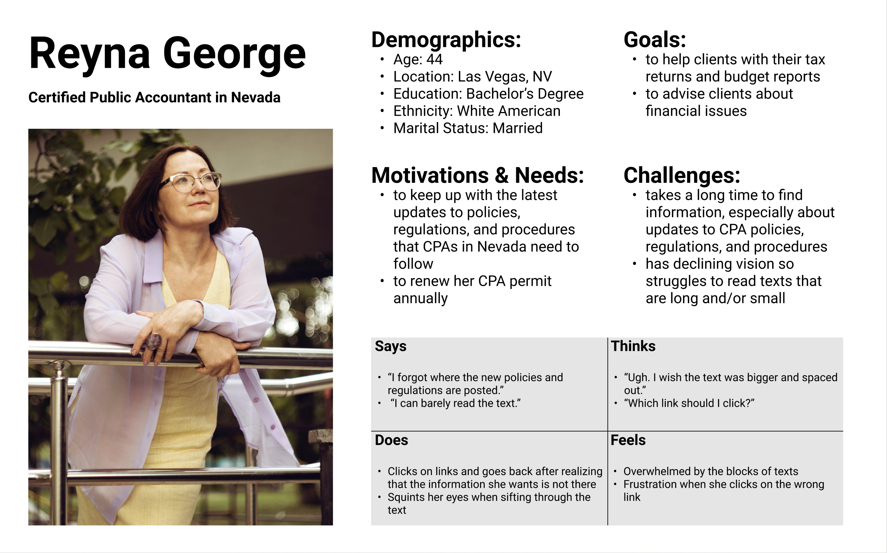
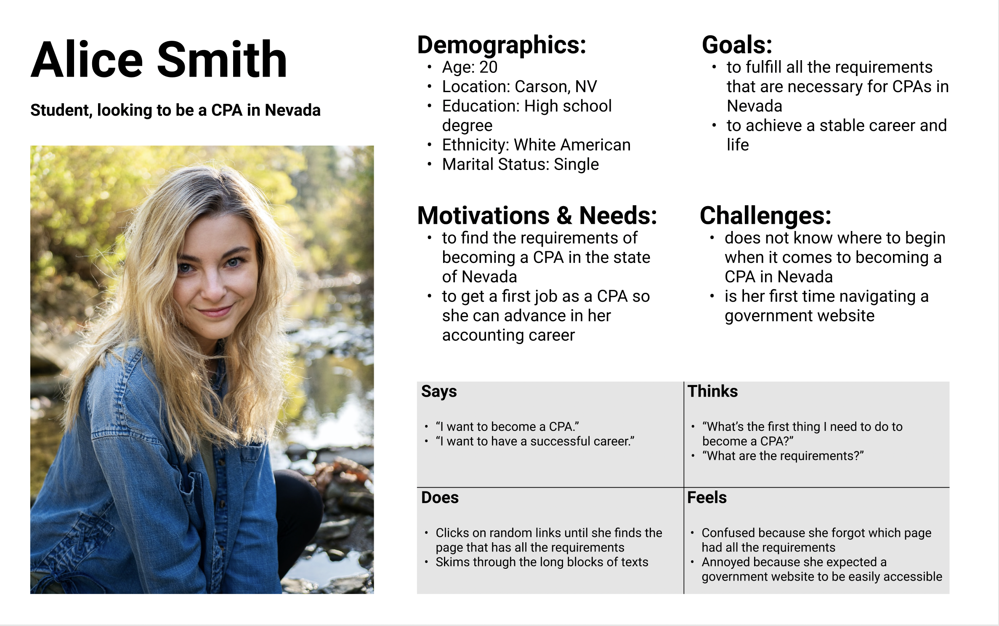
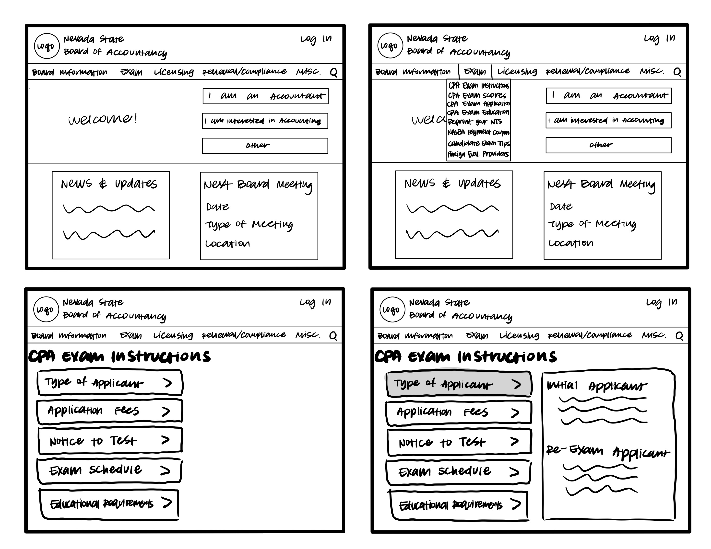
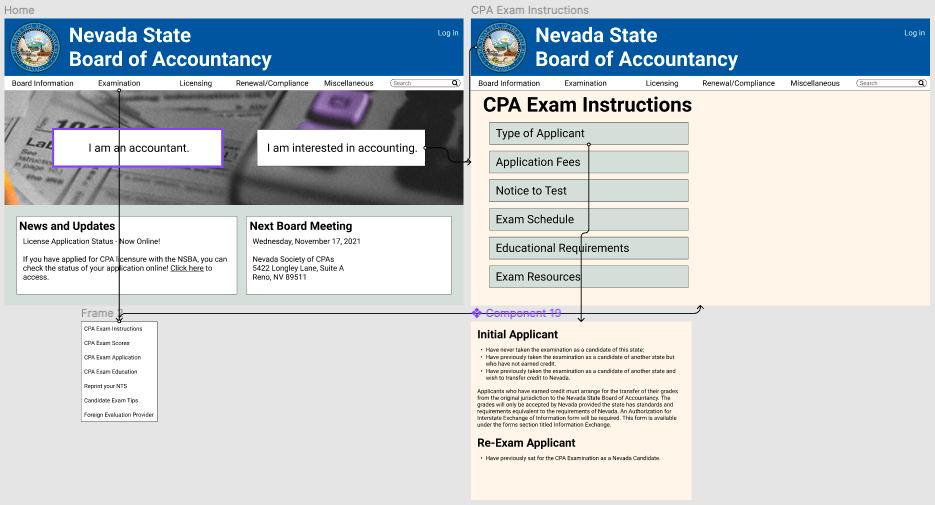

# A Redesign of the Nevada State Board of Accountancy Website
### by Ted Song

## Introduction
This project was about evaluating a government website and redesigning it to enhance a user's experience of the website.
Given that government websites serve as an important hub for information, these websites must be accessible for all users.
These websites need to present information in a clear manner and be easily navigable.
For this project, I chose to study the [Nevada State Board of Accountancy](https://nvaccountancy.com/) website, which is used primarily by people and organizations that work specifically in public accounting.

## Design Statement
Because government websites are used by users who are familiar and users who are unfamiliar with the website, the goal was to redesign the website so that it would by easy to use for new users while still be familiar to users who already know how to use the website. I specifically wanted to focus on redesigning to make it friendly for new users because these users may be interested in working in public accounting and need to be able to find the information they need, but the current website fails to do this.

## Competitor Analysis
I conducted heuristic evaluations of two Nevada government websites. One of the websites was the Nevada State Board of Accountancy website. Overall, the website was simple. However, the site had issues with recognition over recall and aesthetic/minimalistic design. Because there was so much information on the screen, the user would have to recall where certain features and links are. Additionally, the site looked cluttered, which hampered an aesthetic and minimalistic design. The other website I evaluated was the [Nevada Gaming Commission and Gaming Control Board](https://gaming.nv.gov/index.aspx?page=1) website. In contrast, this website felt more welcoming in terms of design (though not in function) because it sports an organized look and a nice menu bar at the top. However, the website still struggled with accomodating for novices like the Nevada State Board of Accountancy website. [Read more](https://github.com/tedsong2001/DH110-2021F/blob/main/Assignments/Assignment%201/Assignment1.md)

I also conducted a usability testing. The user was instructed to perform three tasks: filing a complaint on the website, renewing a CPA license, and finding the requirements to becoming a CPA. Overall, the user displayed confusion when navigating the website. At the end of the usability testing, the user described the website as boring, busy, and overwhelming. Some criticisms of the website were that it was unnecessarily complex, difficult to learn for new users, and cumbersome to use. However, some interesting positive points that the user raised was the website was overall simple and consistent. [Read more](https://github.com/tedsong2001/DH110-2021F/blob/main/Assignments/Assignment%202/Assignment2.md)

## User Research
For the user research, I decided to conduct an interview about finding the requirements that a person needs to fulfill to qualify for a job. In the interview, I found out that the user liked when there was thorough information because it gave them a clearer vision of what the job entails. However, the user didn't like it when sites didn't present such information in an organized manner, meaning that the design of how information is presented should be created in a way that does not require the user to put in a lot of effort to read. [Read more](https://github.com/tedsong2001/DH110-2021F/blob/main/Assignments/Assignment%203/Assignment3.md)

## UX Storytelling
For UX storytelling, I created two personas to shift my perspective to the user's and emphathize with the user's desires, goals, and feelings. One of the personas was a middle-aged woman who is a long-time CPA, but her sight is declining. The other persona is a young college student who is interested in pursuing accounting but is not entirely sure of whether she wants to commit to accounting as a career. To add onto the personas, I also created journey maps for each of the personas. [Read more](https://github.com/tedsong2001/DH110-2021F/blob/main/Assignments/Assignment%204/Assignment4.md)

## Wireframe and Graphic Design Element Variation
For the wireframe, I included a menu bar at the top and new buttons ("I am an accountant" and "I am interested in accounting" and "Other). Bigger font sizes were also used to enhance readability. Additionally, a different layout was used (see CPA Exam Instructions site) so that the information that the user wants to see is provided. [Read more](https://github.com/tedsong2001/DH110-2021F/blob/main/Assignments/Assignment%205/Assignment5.md)

## Low-fidelity Prototype
Below is the wireflow of the low-fidelity prototype. When the user tested out the previous wireframe, they noticed that the "Other" function is very ambiguous and would not serve much purpose for the user. Another point that they raised is that the white space in the CPA Exam Instructions page was a bit awkward and it would be better to directly present information on the page when the user first enters the site. So, this low-fidelity prototype aims to address the issues that the user brought up. Also, the original website sported a purple and grey look, which created a gloomy atmosphere when navigating the website. This new website takes advantage of bright blue and grey colors, which are also Nevada's state colors, thus giving the website an identity. [Read more](https://github.com/tedsong2001/DH110-2021F/blob/main/Assignments/Assignment%206/Assignment6.md)

## High-fidelity Prototype
Below is the link to the interactive prototype. In this prototype, I fixed the issues that the user raised when testing the low-fidelity prototype. I also worked on a log-in page, which is a feature that experienced users will be familiar with. [Read more](https://github.com/tedsong2001/DH110-2021F/blob/main/Assignments/Assignment%207/Assignment07.md)

[Link to interactive prototype](https://www.figma.com/proto/nt8GbxuQnvFVY3Mw0T5Me4/High-Fidelity-Prototype-(Copy)?node-id=133%3A181&starting-point-node-id=133%3A181)

## Pitch Video
[Link to video](https://drive.google.com/file/d/15dsrOZCSAhCamFJ6c3pBBdviVL3OUP8J/view?usp=sharing)

## Conclusion
Overall, I think I accomplished my initial goal of being able to improve a government website and make it more accessible for users, especially new ones to use. Because this was my first project focusing on user experience and design, there were moments when I was scared I didn't know what I was doing, and it even felt like I wasn't making much progress. But, now that I'm reflecting on the final product and looking back on where I started from, I realize that I accomplished a lot through the process. Also, this project was very fruitful in that I gained some experience on what user experience researchers and designers do.

Still, this project came with a few roadbumps. I think that this project taught me that preparation for the research part of user experience and design is very important. For example, I wish that I spent more time generating better questions and tasks when the users were testing out a product. I also definitely could've conducted more user tests, so I could iterate my designs more often.

Next time, I hope to work on a mobile app. I think that researching and designing for mobile apps would be quite a different experience from working with desktop websites.
